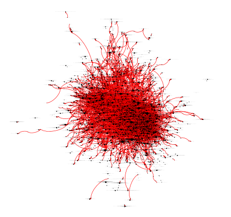

# London Review of Books Dataset
This dataset contains book reviews from the London Review of Books vol 22 no. 1 to vol 44 no. 4. It was created by a scraper that attempts to pull out the name of who reviewed whom. This sometimes results in unparsed authors ("R.G. Collingwood, edited by Rex Martin") but in general it allows us to construct a network graph of reviewers.

The code is designed to detect circularity of reviews. E.g.:
* J. Arch Getty reviewed Sheila Fitzpatrick in vol 22 num 5
* Sheila Fitzpatrick reviewed J. Arch Getty in vol 36 num 6

or

* T.J. Clark reviewed Malcolm Bull in vol 27 num 18
* Malcolm Bull reviewed T.J. Clark in vol 36 num 4

It also allows you to build a network visualization:

Code (c) Martin Paul Eve 2021

